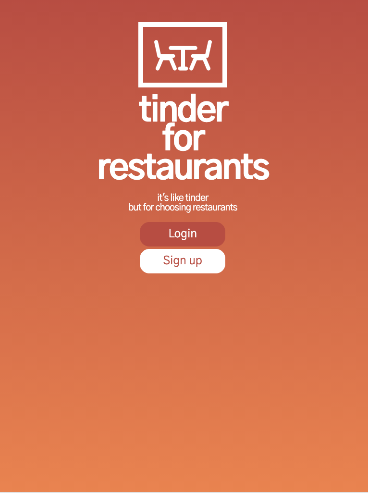
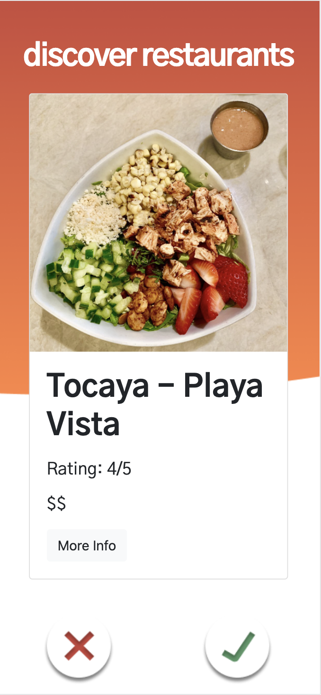
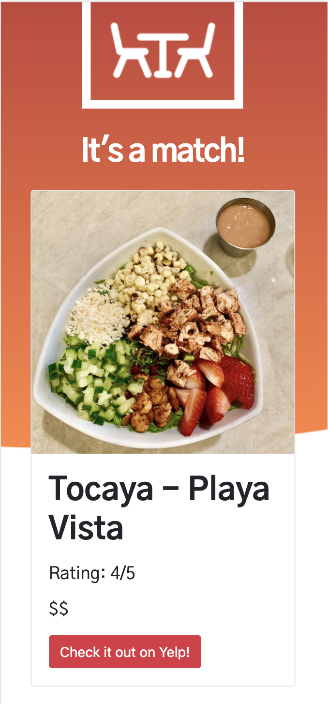

# Tinder for Restaurants

## Authors 

Nick Guimarais, Tristan Pacba, David Oyeyemi, Aileen Wang

## Table of Contents

* [User-Story](#user-story)

* [Technologies](#technologies)

* [Contributions](#contributions)

* [Deployment](#deployment)

## User-Story

* As a user, I want an application that I can use with my friends when we are deciding on a place to eat.

* When I open the application, I am presented with a login screen to input my credentials and a group id/name 

* When other members in our group input their credentials and group id/name, a group is created.

* When our group is signed in, each member is presented with restaurant options based on their location.

* When we look at a restaurant, we are each presented with a picture of the restaurant, price, location, rating, and type of food that the restaurant offers.

* Then the user can press the checkmark button if the user wants to select that restaurant, or they can press an x if the user does not want to select that restaurant. 

* When other users in the group make the same selection, that restaurant will become a match.

* When the group has made their selections out of 10 restaurants, a new list of their matches will be presented to the group. The new list of matches will show how many users in the group picked a certain restaurant. 

* Then the users in the group can narrow down their matches to make a final decision.

* When the final decision is made, that restaurant is selected and presented to the group.

* Then the group can click on the restaurant and book a reservation with yelp, or call the phone number that is listed. 

## Technologies

### Frontend

JavaScript, JQuery, HTML, CSS, Figma

### Backend

Node.js, Express.js, Sequelize, MySQL

## Contributions

### Frontend

Tristan Pacba, Aileen Wang, David Oyeyemi

### Backend

Nick Guimarais, Tristan Pacba

## Deployment

 https://vast-lowlands-43566.herokuapp.com/

## Screenshots

